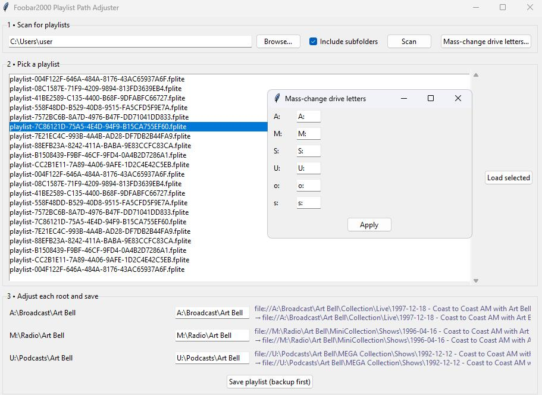

# Playlist-Relinker
Smartly remap music paths in standard and foobar2000 playlists

**Playlist Relinker** is a small, cross-platform Python GUI that rescans your `.m3u`, `.m3u8`, or Foobar2000 `.fplite` playlists, groups the tracks by their drive/folder “root,” and lets you change those roots once—no regex wrangling or text editors required.

* Designed around Foobar2000 conventions, yet completely agnostic: it happily fixes any plain-text playlist.
* Handles bulk drive-letter moves, merged or renamed top-level music folders, and even mass drive-letter swaps across hundreds of playlists in seconds—always keeping a backup of the original.

### Just run the .py file, scan, select, edit.



<br><br><br><br><br><br>
# Total beginner guide:
 
## Repair Broken Playlist Paths on Windows

*(works with foobar2000 playlists & any plain-text `.m3u`/`.m3u8`)*

---

### 0  Check whether Python is already installed (5 sec)

1. Press **Win + R**, type `cmd`, hit **Enter**.
2. In the black window type

   ```cmd
   python --version
   ```

   *If you see something like `Python 3.11.6` — great! Skip to **Step 2**.*
   *If you get an error (“python is not recognised…”) continue to **Step 1**.*

---

### 1  Install Python (**only if you don’t have it**)

| Action | Why                                                                                                                                  |
| ------ | ------------------------------------------------------------------------------------------------------------------------------------ |
| 1.1    | Download **“Windows installer (64-bit)”** from [https://www.python.org/downloads/windows](https://www.python.org/downloads/windows). |
| 1.2    | Run it → **tick “Add Python to PATH”** → *Install Now*.                                                                              |
| 1.3    | Re-run `python --version` in *Step 0* to confirm it works.                                                                           |

You’re done with installation—no further setup is ever needed.

---

### 2  Get the playlist-fixing helper

1. **Download or copy** `foobar_playlist_path_adjuster.py`.
2. Put it **anywhere you like** (Desktop, Documents, a “Tools” folder… the location doesn’t matter).

---

### 3  Run the helper

**Easiest:** double-click the file.
*(If Windows asks what to open it with, choose “Python” or “Python Launcher.”)*

**Alternative (works everywhere):**

```cmd
1. Right-click the folder background ➜ “Open in Terminal”  (or type cmd in the bar)
2. Type  python foobar_playlist_path_adjuster.py
   and press Enter
```

A blue-and-white window will appear.

---

### 4  Scan for playlists

1. Click **Browse…** ➜ choose the top-level folder that holds your playlists
   *(your Music folder, an external drive, etc.)*
2. Leave **Include subfolders** ticked unless you only want that one folder.
3. Click **Scan**. All `.m3u`, `.m3u8`, and `.fplite` files show up.

---

### 5  Fix a single playlist

1. **Double-click** a playlist in the list — it highlights in **blue**.
2. In the lower panel you’ll see rows like

   ```text
   Original root:   S:\Music\Green Day
   Change to:       [ S:\Music\Green Day ]       (live preview shows below)
   ```

   *The preview shows the **before** line, then “→” and the **after** line.*
3. Edit only the part that moved (e.g. change `S:\Music` to `D:\Audio`).
4. When all rows look correct, click **Save playlist (backup first)**.
   A **backup** of the untouched file is placed in a new *backup* folder beside it.

---

### 6  Fix drive letters in **every** playlist at once (optional)

1. Click **Mass-change drive letters…**.
2. Each drive it found ( `C`, `D`, `S` …) appears with its own box.
   *Boxes show **just the letter** — type the new letter if it changed.*
3. Press **Apply to all playlists**.
   Every playlist is updated and a backup is created automatically.

---

### 7  Test in foobar2000

Open foobar2000 ➜ load one of the repaired playlists.
If everything plays without “File not found” errors, you’re done!
(If not, replace the file with the copy inside the *backup* folder and try again.)

---

### 8  Next time

Whenever you move music to another drive or rename a top-level folder, just:

1. **Run the script** (no reinstall needed).
2. **Scan ➜ Edit ➜ Save** or use **Mass-change drive letters**.

Happy listening!
